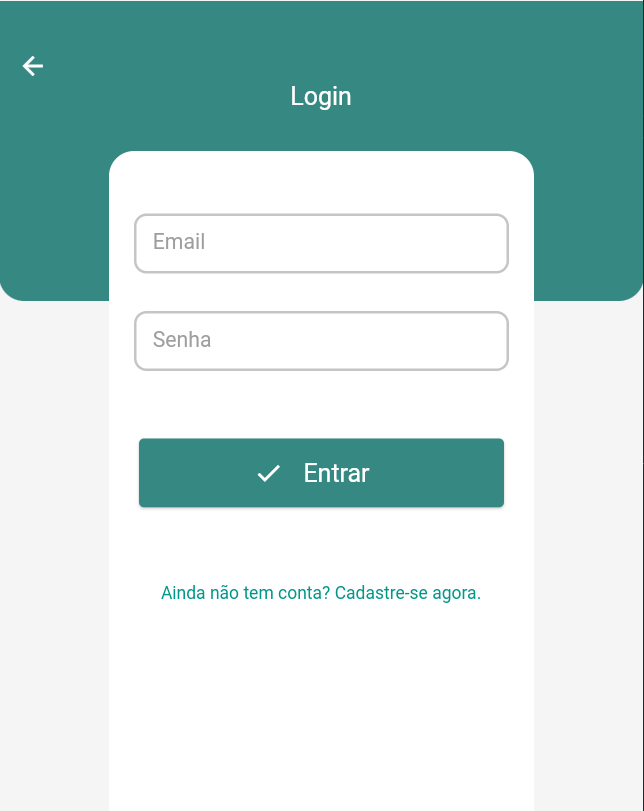
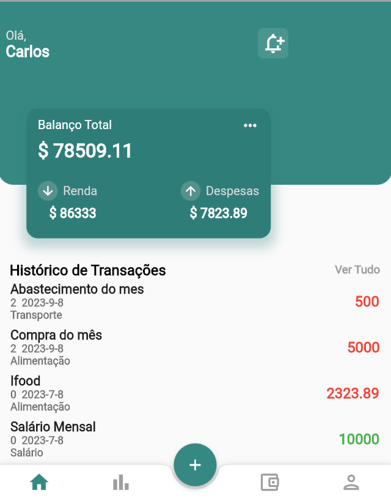
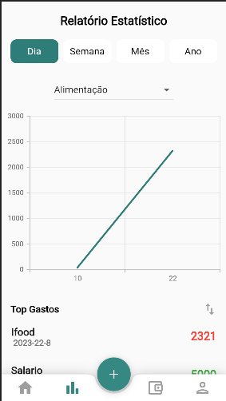
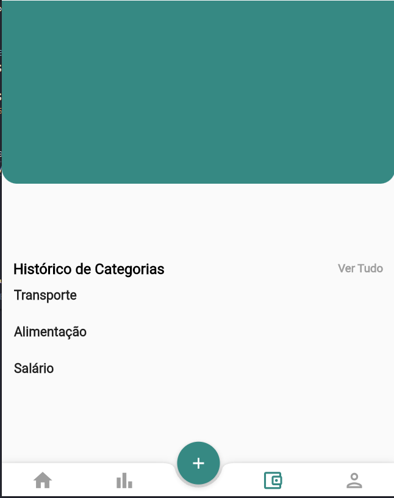
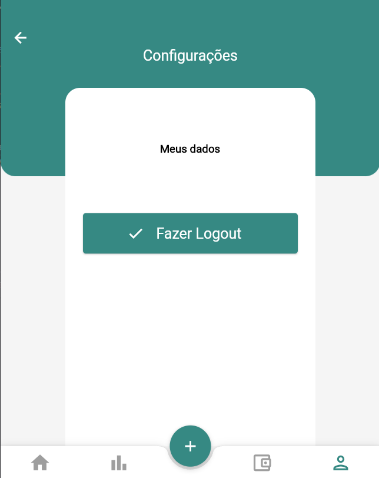

# Aplicação Financeira

O software produzido trata-se de um sistema de gestão financeira pessoal, que tem como objetivo, auxiliar o usuário em sua gestão financeira, disponibilizando funcionalidades que o permitirão monitorar seus gastos e realizar seu planejamento financeiro.

## Como usar

Este projeto no padrão aplicativo Flutter.

Para dúvidas de instalação e uso consultar:
[Documentação Online](https://docs.flutter.dev/)

Com exemplos de execução, configuração de ambiente, etc.
## Já desenvolvido

### Tela de Login
</img>

### Tela de Home e menu
</img>

### Tela de Estatísticas
</img>

### Tela de Categorias
</img>

### Tela de Configurações
</img>